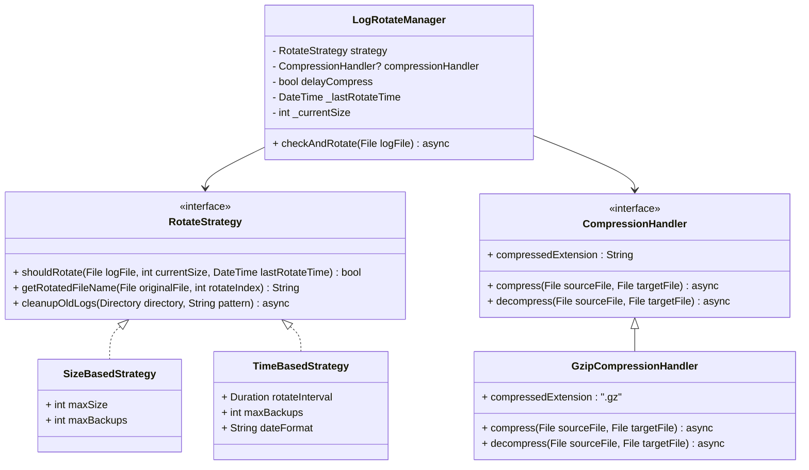
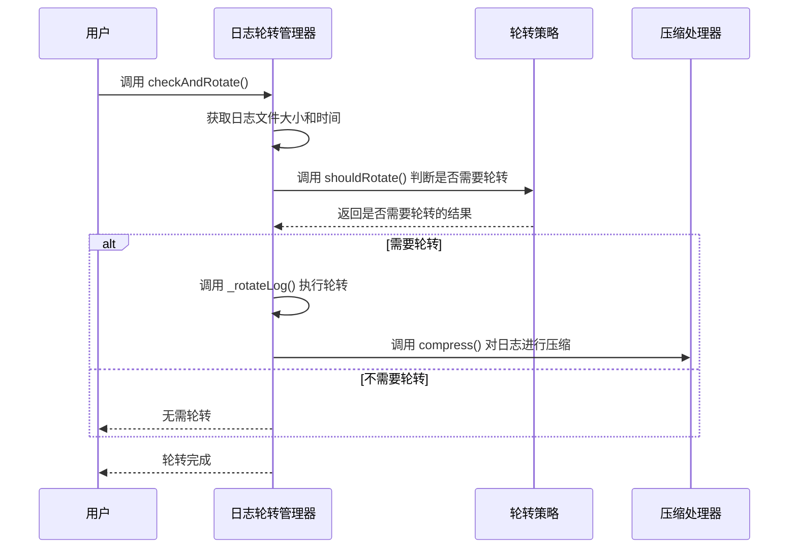

### 日志轮转库的功能简介

当前的日志轮转库具备以下功能：

#### 1. **日志轮转功能**
   - **轮转策略接口** (`RotateStrategy`)：支持基于多种条件的轮转逻辑，例如：
     - **基于文件大小的轮转**：当日志文件大小超过指定阈值时触发。
     - **基于时间的轮转**：根据时间间隔触发轮转。
   - **轮转后的文件管理**：
     - 自动生成轮转后的文件名。
     - 支持清理过期的日志文件，避免占用存储空间。

#### 2. **日志压缩功能**
   - 提供了通用的日志压缩接口 (`CompressionHandler`)。
   - 默认实现了 Gzip 压缩处理器：
     - 在轮转完成后对日志进行压缩。
     - 提供解压缩功能，便于后续分析。

#### 3. **日志管理功能**
   - 提供统一的管理器 (`LogRotateManager`)，协调轮转策略与压缩处理器：
     - 自动检查当前日志是否需要轮转。
     - 支持延迟压缩以优化性能。
   - 配置灵活，可根据需求选择不同的轮转策略和压缩方案。

---

### 使用 Mermaid 展示抽象层次与功能结构

#### **架构抽象层次图**


---

#### **主要功能流程图**
以下流程展示了日志管理器如何整合轮转策略和压缩处理器完成日志轮转。



---

### 用法示例

#### **基于文件大小的日志轮转**
```dart
final manager = LogRotateManager(
  strategy: SizeBasedStrategy(maxSize: 10 * 1024 * 1024), // 10MB
  compressionHandler: GzipCompressionHandler(),
);

await manager.checkAndRotate(File('logs/app.log'));
```

#### **基于时间的日志轮转**
```dart
final manager = LogRotateManager(
  strategy: TimeBasedStrategy(
    rotateInterval: Duration(days: 1), // 每天轮转一次
    maxBackups: 7, // 保留最近7天的日志
  ),
  compressionHandler: GzipCompressionHandler(),
);

await manager.checkAndRotate(File('logs/app.log'));
```

#### **日志清理**
日志轮转策略中提供了 `cleanupOldLogs`，可用于清理过期文件。例如：
```dart
final strategy = SizeBasedStrategy(maxSize: 10 * 1024 * 1024, maxBackups: 5);
await strategy.cleanupOldLogs(Directory('logs'), '*.log*');
```

---

### 总结

通过 **Mermaid 图** 和示例代码，可以看出当前日志轮转库设计层次清晰、功能丰富，具有以下优势：
1. **模块化设计**：通过接口定义实现灵活的扩展性。
2. **灵活的轮转策略**：支持按大小和时间轮转，满足多种应用场景需求。
3. **可选的日志压缩**：支持压缩和解压，提升存储效率。

未来可以进一步扩展，例如：
- 添加 **基于事件的轮转策略**（如特定条件触发）。
- 提供更多压缩方式支持（如 Zip 或 Brotli）。